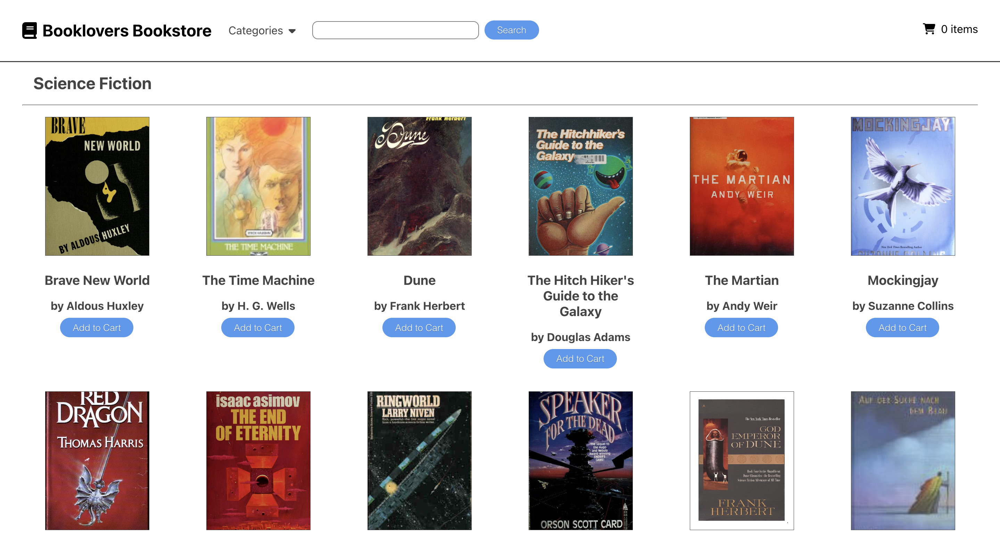

# Booklovers Bookstore

;

Booklovers bookstore is a generic online shopping application. It is built on React and React Router, tested using Jest and React Testing Library, and uses book and cover data from the [Open Library API](https://openlibrary.org/dev/docs/api/).

The application allows a user to search for books by subject or keyword, and navigate to a page displaying the results of their search and potentially add books to their cart. At any time, the user can navigate to their cart using a link in the navbar, to check the items they have added and view their calculated total cost.

This app was built as part of the curriculum at [The Odin Project](theodinproject.com), and generic project specs can be found at [https://www.theodinproject.com/lessons/javascript-shopping-cart].

# Photos

Photo by Ksenia Chernaya: https://www.pexels.com/photo/books-on-shelves-3952071/
Photo by cottonbro studio: https://www.pexels.com/photo/man-in-gray-long-sleeve-suit-holding-a-pen-8369520/
Photo by picjumbo.com: https://www.pexels.com/photo/red-roses-close-up-photography-196664/
Photo by Hristo Fidanov: https://www.pexels.com/photo/milky-way-galaxy-during-nighttime-1252890/
Photo by Craig Adderley: https://www.pexels.com/photo/hungarian-horntail-dragon-at-universal-studios-3359734/
