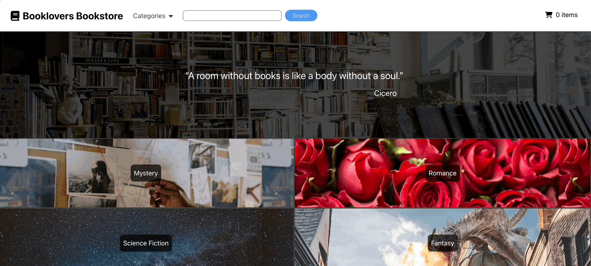

# Booklovers Bookstore

<kbd></kbd>

Booklovers bookstore is a generic online shopping application. It is built on React and React Router, tested using Jest and React Testing Library, and uses book and cover data from the [Open Library API](https://openlibrary.org/dev/docs/api/).

The application allows a user to search for books by subject or keyword, and navigate to a page displaying the results of their search and potentially add books to their cart. At any time, the user can navigate to their cart using a link in the navbar, to check the items they have added and view their calculated total cost.

This app was built as part of the curriculum at [The Odin Project](theodinproject.com), and generic project specs can be found at https://www.theodinproject.com/lessons/javascript-shopping-cart.

## Installation

A live version of this app can be at https://mjande.github.io/booklovers-bookstore/.

To use the app locally, clone the repo and initialize using the instructions below:

```sh
git clone https://github.com/mjande/booklovers-bookstore
cd booklovers-bookstore

npm install
npm start
```

The appication will be running at `localhost:3000` on your web browser.

## Usage

The usage of this app should be familiar to anyone with experience using an online store.

To find books by subject, use the links on the home page, or access the Categories dropdown at the top of the page. To search by keyword, type your search in the bar at the top, then click search. You will a new page with a listing of books that match your search. Use the forward and backward arrows at the bottom of the page to navigate longer listings.

When you have found a book you wish to purchase, click Add to Cart just below the book you want. The button shouldc change colors and now say Remove from Cart, and the current count of items in your cart (found at the top of the page next to the cart icon) should increase by one. Repeat this process with any book you want to purchase, and if you want to remove a book, click Remove from Cart below the book.

When you have added all your books to your cart, click the cart icon or item count at the top of the page. This will take you to the cart page, where you can see any books you have added to your cart. This page will also display your order total, which includes the subtotal for your books and your fees for taxes and shipping. You can change the quantity of each book by using the quantity input next to the book information. Click Checkout to finalize your purchase.

## Roadmap

There are no immediate plans to add functionality to this application. However, depending on my circumstances, there are features that I may consider implementing in the future:

- Sorting and filtering books by price, language, author, or other categories.
- A mock checkout form
- More categories
- Dark Mode and other display options

There are some limits to the data this app can use for each book because it all comes from the Open Library API. If this project ever increases in scope, I may consider connecting it to the Google Books API, which could potentially offer more informatin for each book, but also would be more time-consuming to implement. Another option would be to create its own dedicated database, where I could manually input data about a limited number of books and offer more curated book records.

# Acknowledgement

Thanks to the folks at The Odin Project discord for advice and support. Book cover photos come from the Open Library API, and all other photos come from pexels.com. Photographers include:

- cottonbro studio: https://www.pexels.com/photo/man-in-gray-long-sleeve-suit-holding-a-pen-8369520/
- Craig Adderley: https://www.pexels.com/photo/hungarian-horntail-dragon-at-universal-studios-3359734/
- Hristo Fidanov: https://www.pexels.com/photo/milky-way-galaxy-during-nighttime-1252890/
- Ksenia Chernaya: https://www.pexels.com/photo/books-on-shelves-3952071/
- picjumbo.com: https://www.pexels.com/photo/red-roses-close-up-photography-196664/
